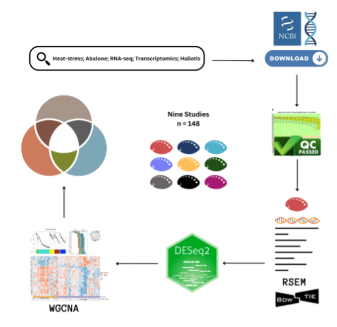

# Abalone-RNAseq-meta-analysis

This repository includes steps in differential gene expression and network analysis of RNAseq data from multiple studies on the transcriptomic response in abalone (Haliotis sp.)

